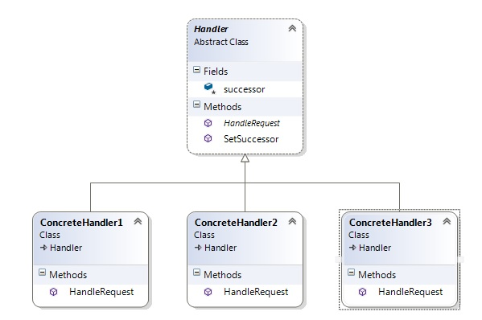

# Chain of Responsibility

Идеята на този шаблон е да се избягва обвързването на заявката с обработката, като се дава шанс на повече от един обект да обработи заявката. Обектите, които обработват заявката са свързани в линейна верига, заявката се подава към първия обект от веригата. Ако той не може да обработи заявката се подава към следващия във веригата докато някой от веригата обработи заявката.

"Веригата от отговорности" опростява връзките между заявката и обектите, които могат да я обработят. Вместо класа с заявката и класовете от веригата да съдържат всички връзки помежду си, всяка заявка съдържа единствена референция към началото на веригата, а всеки клас от отговорната верига съдържа единствена референция към следващия клас във веригата, който евентуално да обработи заявката. Обикновено в последния клас на веригата съдържа 2 варианта - единия обработва заявката, а другия обработва евентуалното неизпълнение на заявката. 

