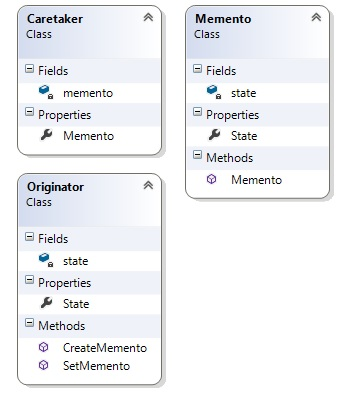

# Memento  

Идеята на този шаблон е създаването връщането на дадено състояние на обект, без да му се нарушава енкапсулацията. Решава проблем с въстановяване на минало състояние на обект (Undo). 

Клиентът решава кога да съхрани състоянието на даден обект, както и той решава кога да го въстанови до това съхранено състояние.

