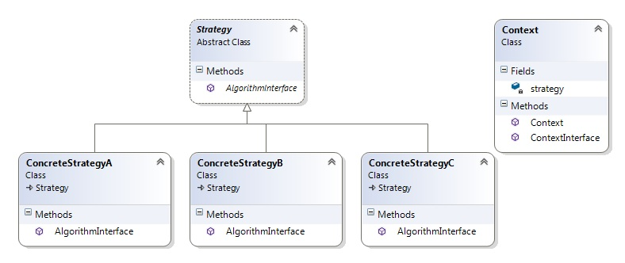

# Strategy 

Идеята на този шаблон е създаването на различни алгоритми за вършене на една и съща работа, скриването на всеки един и правенето им да са взаимозаменяеми. Всеки алгоритъм е независим и варира според клиента, който го ползува. Абстаркцията на алгоритма се извършва чрез интерфейс, докато самата логика се имплементира в клас наследник на интерфейса. Клиентът се обвързва единствени с интерфейса на алгоритмите - не със самата имплементация.

