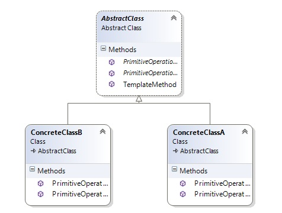

# Template Method

Идеята на този шаблон е създаването на абстрактен клас, който определя някоя обща за подкласовете логика, като оставя подкласовете да имплементират специфичната за всеки от тях логика.
Общите стъпкиот логиката се изнасят в абстрактния клас, а специфичните се имплементират от подкласовете. Всички фреймуърци са реализирани по този начин. Един абстрактен клас, съдържащ всички методи, и всички наследници на този фреймуърк имплементират който метод желаят от предоставените в фреймуърка.

