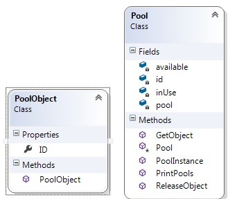

# Object pool
#### a.k.a Resouse pool

Този шаблон е най подходяш в ситуации, когато цената на създаване на нови инстанции е скъпа (време, ресурси).

Основната идея е обектите да се преизползуват, вместо да се създават нови такива.
Класовете в този шаблон са 3 вида:

* **Reusable** - инстанциите на тези класове комуникират с други инстанции за период от време и след това не са нужни.
* **Client** - инстанциите на тези класове използуват _reusable_ инстанции.
* **ReusablePool** - класовете от този вид е управляват _reusable_ обектите за използуване от _client_ обектите

Обикновено _Pool_ класа се реализира чрез Singleton, с цел всички _reusable_ обекти да са на едно място и да няма други "складове".

Склада съдържа две колекции с обекти:
* налични
* използвани от клиенти

Клиентът се обръща към склада за обект, ако този обект е наличен в склада му се предоставя, вади се от колекцията с наличните и се вкарва в обекта с използувани - когато клиентът връша обект се случва обратното. Ако клиента изисква обект, който не е наличен в наличните, се извиква логика за създаване на нов обект. Ако лимита на склада е стигнат (добра практика е да се лимитира размера на склада), клиентът чака докато друг клиент освободи нужния му обект, да го върне в склада и след това да си го получи.

P.S. В примерния си код ще използувам само един клас за създаване на _reusable_ обекти.
Също няма да лимитирам склада, защото примерът ще е простичък.