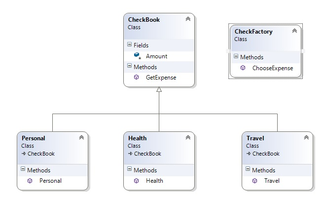

# Simple Factory 



Този шаблон връща инстанция на един от няколко възможни класа, в зависимост от параметрите, с които е създаден. Това изисква вариантите на класовете да наследяват един родителски клас.

``` c#
public class Factory
    {
        public ParentClass DoSomething(int number)
        {
            switch (number)
            {
                case 1:
                    return new Child1();
                case 2:
                    return new Child2();
                default:
                    return new Child3();
            }
        }
    }
```

Класа фабрика в метода си връща стойност от тип родителския клас. Това означава, че метода може да връща инстанции от класовете на наследниците на родителския клас. Метода в фактори класа решава каква инстанция иска да се създаде.

``` c#
public ParentClass
	{
    	public ParentClass() 
        {
        	// Common fields of the child classes
        }
        
        public CommonMethod() 
        {
        	// Common logic of the child classes
        }
        
        virtualMethods()
        {
        	// each child class overrides to its own needs
        }
     }
   ```
   
  