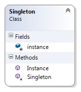

# Singleton



Шаблонът "Сингълтън" е един от най-използуваните шаблони, чиято цел е създаването на единствена инстанция на класа. В общи линии този шаблон не позволява да се създава инстанция приемаща дадени параметри, защото при повторна заявка за създаване с различен параметър, тя просто няма да се създаде и ще остане инстанцията със първия създаден параметър.

``` c#
public class Singleton
{
    private static Singleton instance=null;

    private Singleton()
    {
    }
    -->
```
**Важното е конструктора да има ниво на достъп _protected_ или _private_**, за да не може да се създават инстанции с ключовата дума _new_. Тъй като ако не декларираме празния конструктор (което не е задължително защото се създава автоматично от компилатора), той би имал ниво на достъп _public_, **сме длъжни да декларираме празния конструктор**. 

Пропъртито _Instance_ може и да е метод.
    
``` c#
	>--
    public static Singleton Instance
    {
        get
        {
            if (instance==null)
            {
                instance = new Singleton();
            }
            return instance;
        }
    }
} 
```

Тази имплементация не е удачна в многонишкова среда, защото ако в един и същ момент 2 нишки достъпят класа и все още няма инициализирана инстанция, то ще бъде създадена инстанция от всяка нишка, която е достъпила класа в това време и все още не е инициализирала инстанция.

Това може да се реши чрез "ключалки", които няма да посочвам тук, или по следния по-елегантен начин:
``` c#
public sealed class Singleton
{
    private Singleton()
    {
    }

    public static Singleton Instance { get { return Nested.instance; } }
        
    private class Nested
    {
        // Explicit static constructor to tell C# compiler
        // not to mark type as beforefieldinit
        static Nested()
        {
        }

        internal static readonly Singleton instance = new Singleton();
    }
}
```

Статичния конструктор, според спецификацията се изпълнява най-много един път за  приложение, което решава проблема в многонишкова среда, а освен това по този начин се слага флаг _beforefieldinit_ на следващото поле _instance_(коeто на практика е шорткът на пропъртито _instance_ от миналия пример), което позволява променливата да се създаде точно при първото извикване на класа _Nested_, а факта, че полето е _readonly_, не позволява презаписването му. Класа е нестнат, защото всички статични полета, според спецификацията, се създават при първото извикване на статичен метод, което би разрушило "мързеливото зареждане".

Това може да се реши и чрез Lazy\<T> класа, достъпен след .NET 4

``` c#
public sealed class Singleton
{
    private static readonly Lazy<Singleton> lazy =
        new Lazy<Singleton>(() => new Singleton());
    
    public static Singleton Instance { get { return lazy.Value; } }

    private Singleton()
    {
    }
}
```

P.S. тъй като примерът е простичък и не изисква многонишково изпълнение - използувам първия вариант за да го демонстрирам.

Минуси:
* нарушава SRP 
* Singleton класа е труден за тестване
* силен каплинг между класовете