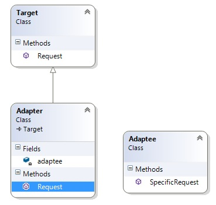

# Adapter 

Идеята на този шаблон е да конвертира даден клас така че клиентът да може да го ползува. Адапрерът позволява на несъвместими класове да работят заедно.

Участниците в този патърн са:
* Цел - определя интерфейса, който клиента използува
* адаптер - съвмещава несъвместимия клас, за да може да работи с целевия интерфейс
* адаптиран клас - съществуваш клас с несъвместим интерфейс, който трябва да се адаптира чрез адаптера

