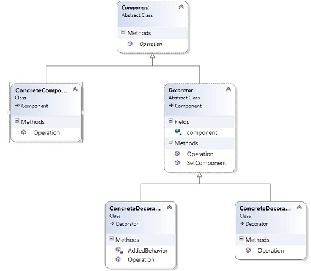

# Decorator  

Идеята на този шаблон е динамично да се добавят допълнителни свойства на обектите. Декоратора предоставя алтернатива за добавяне на свойства. Ако искате да добавите свойство или метод по време на изпълнението, наследяването не може да ви свърши работа защото се наследява всичко.

В този шаблон се обособяват следните компоненти:

The classes and objects participating in this pattern are:
* компонент - интерфейс, който определя обектите към които ще добавяме свойства
* конкретен компонент - обект към който ще прикачаме свойства
* декоратор - съдържа референция към компонентния обект и дефинира интерфейс, който подхожда на компонентния интерфейс
* конкретен компонент - добавя свойства към компонента

