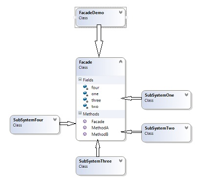

# Facade

Този структурен шаблон се използува за скриване на сложна логика на един или много класове в един "опаковъчен" клас от по-високо ниво с опростена логика, което улеснява използуването на сложната логика. Опакова сложната логика от подсистема в по-лесен за използуване интерфейс. 

Фасада се постига чрез създаване на посреднически клас (който обикновено се създава чрез Singleton), който опакова сложността на системата. Клиентът се свързва единствено с този фасаден клас. При нужда от допълнителна функционалност се променя фасадния клас.